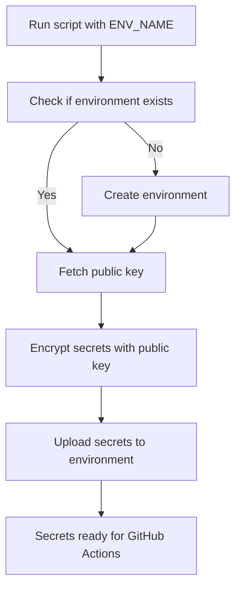

The **README.md**  covers **multi‑environment automation** (DEV, QA, PROD) with parameterization. This way, you don’t have to hardcode `ENVIRONMENT = "DEV"` in your Python script; instead, you can pass the environment name and secrets dynamically.

---

## 📄 README.md — Automating GitHub Environments and Secrets

### 🔑 1. Why automate environments + secrets?
- GitHub Actions uses **environments** (DEV, QA, PROD) to scope secrets and apply approval rules.
- Automating creation and secret management ensures consistency across repos.
- Secrets are encrypted and injected securely into workflows.

---

### ⚙️ 2. Prerequisites
- **GitHub Personal Access Token (PAT)** with scopes:
  - `repo`
  - `admin:repo_hook`
- Store PAT in your local environment:
  ```bash
  export GITHUB_TOKEN=ghp_yourtokenhere
  ```
- Python 3.8+ installed.
- Install dependencies:
  ```bash
  pip install requests cryptography
  ```

---

### 📂 3. Python Script (Multi‑Environment)

Save as `scripts/manage_env_secrets.py`:

```python
#!/usr/bin/env python3
import os, sys, base64, requests
from cryptography.hazmat.primitives import serialization, hashes
from cryptography.hazmat.primitives.asymmetric import padding

# --- Config ---
GITHUB_TOKEN = os.environ["GITHUB_TOKEN"]  # PAT stored in env var
OWNER = "your-github-username-or-org"
REPO = "test-dbx"

# Secrets dictionary per environment
ENV_SECRETS = {
    "DEV": {
        "DATABRICKS_HOST_DEV": "https://adb-dev.azuredatabricks.net",
        "DATABRICKS_TOKEN_DEV": "your-dev-token",
        "SQL_WAREHOUSE_ID_DEV": "dev-warehouse-id",
        "DATABRICKS_CLUSTER_ID_DEV": "dev-cluster-id"
    },
    "QA": {
        "DATABRICKS_HOST_QA": "https://adb-qa.azuredatabricks.net",
        "DATABRICKS_TOKEN_QA": "your-qa-token",
        "SQL_WAREHOUSE_ID_QA": "qa-warehouse-id",
        "DATABRICKS_CLUSTER_ID_QA": "qa-cluster-id"
    },
    "PROD": {
        "DATABRICKS_HOST_PROD": "https://adb-prod.azuredatabricks.net",
        "DATABRICKS_TOKEN_PROD": "your-prod-token",
        "SQL_WAREHOUSE_ID_PROD": "prod-warehouse-id",
        "DATABRICKS_CLUSTER_ID_PROD": "prod-cluster-id"
    }
}

def github_api(path, method="GET", data=None):
    url = f"https://api.github.com/repos/{OWNER}/{REPO}{path}"
    headers = {"Authorization": f"Bearer {GITHUB_TOKEN}", "Accept": "application/vnd.github+json"}
    resp = requests.request(method, url, headers=headers, json=data)
    resp.raise_for_status()
    return resp.json() if resp.text else {}

def create_environment(env):
    path = f"/environments/{env}"
    try:
        github_api(path, "GET")
        print(f"Environment '{env}' already exists.")
    except requests.HTTPError as e:
        if e.response.status_code == 404:
            github_api(path, "PUT", {"wait_timer": 0})
            print(f"Environment '{env}' created.")
        else:
            raise

def get_public_key(env):
    path = f"/environments/{env}/secrets/public-key"
    return github_api(path)

def set_secret(env, name, value, key_id, public_key):
    public_key_bytes = base64.b64decode(public_key)
    pubkey = serialization.load_der_public_key(public_key_bytes)
    encrypted = pubkey.encrypt(
        value.encode(),
        padding.OAEP(mgf=padding.MGF1(algorithm=hashes.SHA256()), algorithm=hashes.SHA256(), label=None)
    )
    encrypted_value = base64.b64encode(encrypted).decode()
    path = f"/environments/{env}/secrets/{name}"
    github_api(path, "PUT", {"encrypted_value": encrypted_value, "key_id": key_id})
    print(f"Secret '{name}' set in {env}.")

if __name__ == "__main__":
    if len(sys.argv) < 2:
        print("Usage: python manage_env_secrets.py ENV_NAME")
        sys.exit(1)

    env = sys.argv[1].upper()
    if env not in ENV_SECRETS:
        print(f"Unknown environment: {env}")
        sys.exit(1)

    create_environment(env)
    pk = get_public_key(env)
    key_id, public_key = pk["key_id"], pk["key"]
    for name, value in ENV_SECRETS[env].items():
        set_secret(env, name, value, key_id, public_key)
```

---

### 🧪 4. Usage

- To set up **DEV**:
  ```bash
  python scripts/manage_env_secrets.py DEV
  ```
- To set up **QA**:
  ```bash
  python scripts/manage_env_secrets.py QA
  ```
- To set up **PROD**:
  ```bash
  python scripts/manage_env_secrets.py PROD
  ```

The script will:
- Create the environment if missing.
- Overwrite all secrets defined in `ENV_SECRETS`.

---

### ✅ 5. Best Practices
- **Parameterize environments**: Avoid hardcoding; reuse script across DEV/QA/PROD.
- **Rotate secrets** regularly (Databricks tokens, warehouse IDs).
- **Scope PAT minimally**: only repo + admin:repo_hook.
- **Audit environments**: confirm secrets are correct before deployments.

---

### 📊 6. Workflow Diagram



---

## ✅ Summary
This script + README gives you a **repeatable way** to manage GitHub environments and secrets for **DEV, QA, PROD**. Run once per environment to bootstrap secrets, then your GitHub Actions workflows can consume them securely.

---

👉 Would you like me to also add a **section showing how to call this script automatically from CI/CD (e.g., GitHub Actions job)** so environments stay in sync without manual runs?
